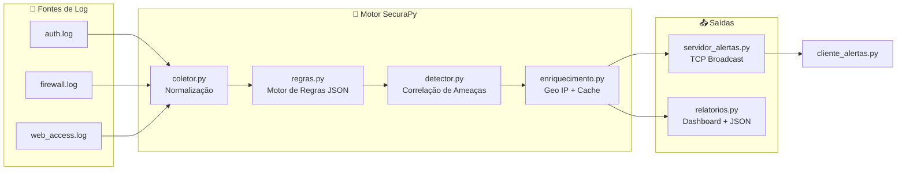

# SecuraPy — SIEM Simplificado


> **Trabalho Final Prático — Disciplina: Coding for Security | FIAP**  
> Sistema SIEM educacional desenvolvido do zero em Python puro, sem dependência de ferramentas comerciais como Splunk ou ELK Stack.

---

## English Overview

**SecuraPy** is an educational SIEM (Security Information and Event Management) system built entirely in Python as a university final project for a *Coding for Security* course. It ingests three log source types, applies a JSON-configurable detection engine, correlates multi-event attack patterns, enriches IPs via geolocation API, and broadcasts real-time alerts over TCP sockets.

**Skills demonstrated:** Python, TCP sockets, multithreading, log parsing, JSON-driven rule engine, REST API consumption, threat correlation, error handling, modular architecture.

---

## Descrição

O **SecuraPy** coleta, analisa e correlaciona eventos de segurança de múltiplas fontes de log em tempo real, detectando ataques como:

- **Brute Force** em SSH/autenticação
- **Port Scan** via análise de firewall
- **IPs em Blacklist** conhecidos
- **Ataques Web** — Path Traversal, XSS, SQLi, Reconhecimento

---

## 🏗️ Arquitetura



---

## Estrutura do Projeto

```
GS-Laboratorio-SIEM/
├── main.py                 # Ponto de entrada e orquestração
├── coletor.py              # Módulo 1: Coleta e normalização de logs
├── regras.py               # Módulo 2: Motor de regras configurável
├── detector.py             # Módulo 3: Correlação e detecção
├── servidor_alertas.py     # Módulo 4: Servidor TCP de alertas
├── cliente_alertas.py      # Módulo 4: Cliente TCP de alertas
├── enriquecimento.py       # Módulo 5: Geolocalização de IPs
├── relatorios.py           # Módulo 6: Dashboard e exportação
├── constantes.py           # Centraliza BLACKLIST e caminhos (sem duplicação)
├── config/
│   └── regras.json         # Regras de detecção R001–R005 (editável)
├── logs/
│   ├── auth.log            # Logs de autenticação (SSH, sudo)
│   ├── firewall.log        # Logs de firewall (UFW/iptables)
│   └── web_access.log      # Logs de acesso web (Apache/Nginx)
├── saida/                  # Relatórios JSON exportados (no .gitignore)
├── requirements.txt
├── .gitignore
└── LICENSE
```

---

## Início Rápido

### Pré-requisitos

- Python 3.8+
- pip

### Instalação

```bash
git clone https://github.com/rafaeldev-ops/GS-Laboratorio-SIEM.git
cd GS-Laboratorio-SIEM
pip install -r requirements.txt
```

### Execução

```bash
# Sistema principal (análise + dashboard)
python main.py

# Servidor de alertas TCP (terminal 1)
python servidor_alertas.py

# Cliente de alertas (terminal 2)
python cliente_alertas.py
```

---

## Detecções e Mapeamento MITRE ATT\&CK

| Regra | Nome | Técnica ATT&CK | Tática | Severidade |
|-------|------|---------------|--------|------------|
| R001 | Login de Usuário Privilegiado | [T1078](https://attack.mitre.org/techniques/T1078/) – Valid Accounts / [T1110](https://attack.mitre.org/techniques/T1110/) – Brute Force | Initial Access / Credential Access | 🔴 Alta |
| R002 | Acesso a Porta Crítica | [T1046](https://attack.mitre.org/techniques/T1046/) – Network Service Discovery | Discovery | 🟡 Média |
| R003 | Path Traversal | [T1190](https://attack.mitre.org/techniques/T1190/) – Exploit Public-Facing Application | Initial Access | 🔴 Alta |
| R004 | XSS em Requisição Web | [T1190](https://attack.mitre.org/techniques/T1190/) – Exploit Public-Facing Application | Initial Access | 🟡 Média |
| R005 | Reconhecimento Web (Scanner) | [T1595](https://attack.mitre.org/techniques/T1595/) – Active Scanning | Reconnaissance | 🟡 Média |
| —    | Correlação: Brute Force | [T1110.001](https://attack.mitre.org/techniques/T1110/001/) – Password Guessing | Credential Access | 🔴 Alta |
| —    | Correlação: Port Scan | [T1046](https://attack.mitre.org/techniques/T1046/) – Network Service Discovery | Discovery | 🔴 Alta |
| —    | Blacklist de IPs | [T1090](https://attack.mitre.org/techniques/T1090/) – Proxy (Tor Exit Node) | Command and Control | 🔴 Alta |

> Mapeamentos baseados em MITRE ATT&CK v19 (abril de 2026).

---

## Dados de Exemplo

Os arquivos em `logs/` contêm dados sintéticos realistas para demonstração:

| Fonte | Conteúdo |
|-------|----------|
| `auth.log` | Brute force SSH contra root/admin, logins legítimos |
| `firewall.log` | Port scan em portas críticas, tráfego bloqueado da blacklist |
| `web_access.log` | Path traversal, XSS, SQLi, scanners Nikto/sqlmap/DirBuster |

**IPs simulados:**

| IP | Origem simulada |
|----|----------------|
| `185.220.101.1` | Nó de saída Tor (bloco 185.220.101.x/DE) |
| `45.33.32.156` | Host de reconhecimento (referência: scanme.nmap.org) |
| `91.240.118.172` | Host com histórico de varreduras |
| `23.94.5.100` | Host associado a atividade de spam/scanning |

---

## Configurando Regras

Edite `config/regras.json` para personalizar detecções sem modificar o código:

```json
{
  "id": "R002",
  "nome": "Acesso a Porta Crítica",
  "condicao": "porta_critica",
  "portas": [22, 23, 445, 3389, 3306, 5432, 1433],
  "severidade": "media"
}
```

---

## Limitações Conhecidas

- **Servidor de alertas escuta em `0.0.0.0:9999` sem autenticação** — adequado para laboratório local; não expor em ambientes de produção sem adicionar TLS e autenticação.
- **Rate limit da ipinfo.io** — o módulo de enriquecimento trata o erro HTTP 429 com backoff, mas o plano gratuito tem limite de 50k req/mês. Substitua pela variável `IPINFO_TOKEN` para planos pagos.
- **Reimplementação educacional** — este projeto reimplementa conceitos de SIEM do zero em Python. Não é um substituto para soluções corporativas como Wazuh, Elastic SIEM ou Splunk.

---

## Equipe

| Integrante | Módulo Principal |
|-----------|-----------------|
| Pessoa A | Coletor de Logs (Módulo 1) |
| Pessoa B | Motor de Regras + Detector (Módulos 2 e 3) |
| Pessoa C | Servidor/Cliente de Alertas (Módulo 4) |
| Pessoa D | Enriquecimento + Relatórios (Módulos 5 e 6) |

---

## Licença

Distribuído sob a licença MIT. Veja [`LICENSE`](LICENSE) para mais detalhes.
